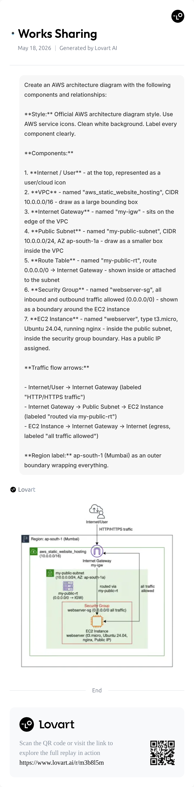
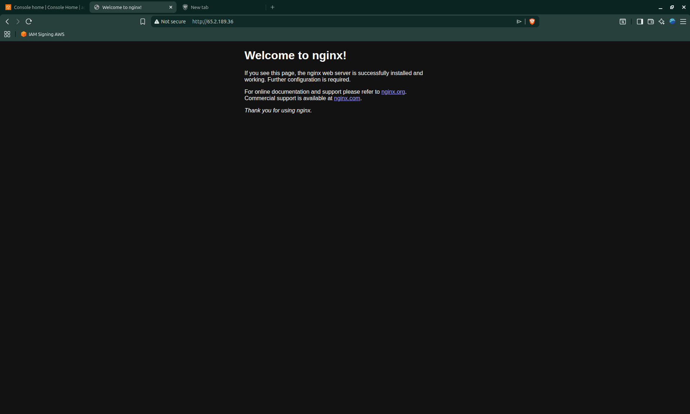

# AWS Static Website Hosting

AWS Infrastructure in Terraform to host basic static website

## Internship Details

- Intern ID: `CITS752`
- Name: Shoban Chiddarth
- No. of weeks: 4
- Project Name: AWS Static Website Hosting
- Project Scope: Cloud Computing

## Architecture

This project deploys a single nginx web server on AWS in the **ap-south-1 (Mumbai)** region.

### Components

- **VPC** (`aws_static_website_hosting`) - Isolated network with CIDR `10.0.0.0/16`
- **Internet Gateway** (`my-igw`) - Attached to the VPC, enables internet access
- **Public Subnet** (`my-public-subnet`) - CIDR `10.0.0.0/24` in AZ `ap-south-1a`
- **Route Table** (`my-public-rt`) - Routes all outbound traffic (`0.0.0.0/0`) to the Internet Gateway, associated with the public subnet
- **Security Group** (`webserver-sg`) - Allows all inbound and outbound traffic (`0.0.0.0/0`)
- **EC2 Instance** (`webserver`) - `t3.micro`, Ubuntu 24.04, with nginx installed via user data script. Assigned a public IP automatically.

```

Internet
|
Internet Gateway (my-igw)
|
Public Subnet (10.0.0.0/24)
|
EC2 - webserver (t3.micro, nginx)
```

Inbound traffic from the internet reaches the EC2 instance via the Internet Gateway and the public subnet route table. The instance is publicly accessible on all ports.

## Architecture Diagram



## Output



## Source Code

See inside `aws-infrastructure/`

## Steps to run

1. `cd aws-infrastructure`
2. (Create `.env` file with AWS credentials)
3. `terraform init`
4. `terraform plan -out=plan.tfplan`
5. `terraform apply plan.tfplan`

To destroy

1. `terraform destroy`
